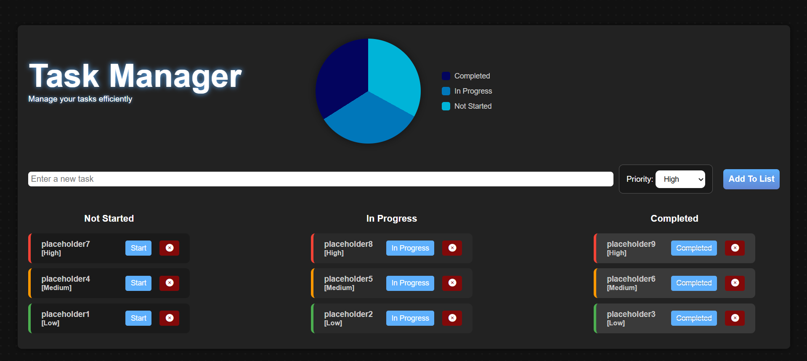

# task-manager --Version update: v2.0
Simple task manager that can list tasks according to the priority and keeps track on the status of the task. Built as a learning project for web development and entirely with HTML, vanilla JavaScript and CSS without using backend.

🔗 Live Demo: https://oykunazergelen.github.io/task-manager/

---

## ✨ Features
- Add and delete tasks
- Priority-based task sorting (High / Medium / Low)
- Task status flow: **Not Started → In Progress → Completed**
- Responsive design (desktop & mobile friendly)
- Animated UI interactions
- **Live pie chart visualization** of task statuses
- Hover-to-view task percentage breakdown

---

## 📊 Pie Chart Dashboard
The dashboard dynamically updates as tasks are:
- added
- deleted
- moved between statuses  

The chart reflects:
- Completed tasks
- Tasks in progress
- Not started tasks  

With smooth transitions and hover-based percentage display.

---

## 🛠️ Tech Stack
- HTML5
- CSS3
- JavaScript (Vanilla JS)

---

## 📁 Folder Structure
- task-manager/
- ├── img/
- ├     └── favicon.svg
- ├── index.html
- ├── main.css
- └── app.js

---

## ▶️ How to Run
- No installation required.
- Download or clone the project
- Open index.html in your browser
- That’s it — the app runs locally with no setup.
or simply visit this site:
👉 https://oykunazergelen.github.io/task-manager/

---

## 🖼️ Screenshots
- 

---

## 🚀 Future Improvements
- Edit existing tasks
- Dark / Light mode toggle
- Due dates & reminders
- Persistent storage (LocalStorage or backend)
- User authentication
- Advanced filters (Completed / Active / Priority)
- Drag & drop task ordering

---

## 📜 License
- This project is free to use and open to everyone.

---

## 👤 Author’s Note
- Hello everyone, and thank you for checking out my project. I built this to deepen my understanding of HTML, CSS, and JavaScript, and to experiment with new methods as I learn more about web development.
Even though the project is simple, it has still been challenging at times—as expected for a student like me.

- As I continue learning backend and full-stack development (such as Node.js and MongoDB), I plan to update and expand this project over time.
Thank you for reading!
